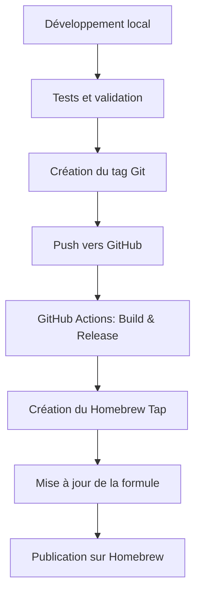

# 📦 Guide de Publication pour Homebrew

Ce guide vous explique comment publier votre CLI `gitact` sur Homebrew pour permettre aux utilisateurs de faire `brew install gitact`.

## 🚀 Vue d'ensemble du processus



## 📋 Prérequis

### 1. Comptes et tokens nécessaires
- [ ] Compte GitHub avec le repository public
- [ ] GitHub CLI installé (`gh`) et authentifié
- [ ] Token GitHub avec permissions `repo` et `workflow`
- [ ] Compte Homebrew (optionnel pour les taps officiels)

### 2. Outils requis
```bash
# macOS
brew install gh git go

# Ubuntu/Debian
sudo apt install git golang-go
curl -fsSL https://cli.github.com/packages/githubcli-archive-keyring.gpg | sudo dd of=/usr/share/keyrings/githubcli-archive-keyring.gpg
echo "deb [arch=$(dpkg --print-architecture) signed-by=/usr/share/keyrings/githubcli-archive-keyring.gpg] https://cli.github.com/packages stable main" | sudo tee /etc/apt/sources.list.d/github-cli.list > /dev/null
sudo apt update && sudo apt install gh
```

## 🏗️ Étape 1: Préparer le Repository GitHub

### 1.1 Structure du repository
```
gitact/
├── .github/
│   └── workflows/
│       └── release.yml       # GitHub Actions pour releases automatiques
├── cmd/                      # (optionnel) commandes CLI
├── internal/                 # (optionnel) packages internes
├── scripts/
│   └── publish.sh           # Script de publication
├── Formula/                 # Formule Homebrew (dans un tap séparé)
├── go.mod
├── go.sum
├── main.go
├── README.md
├── LICENSE
├── CHANGELOG.md
├── Makefile
└── homebrew-formula.rb      # Template de formule
```

### 1.2 Créer le repository principal
```bash
# Si pas encore fait
gh repo create gitact --public --description "Modern interactive CLI for exploring GitHub profiles"
git remote add origin https://github.com/yourusername/gitact.git
```

### 1.3 Configurer GitHub Actions
Le fichier `.github/workflows/release.yml` doit être configuré pour :
- Compiler pour plusieurs plateformes (Linux, macOS, Windows)
- Créer les archives avec checksums SHA256
- Publier les releases automatiquement sur les tags
- Mettre à jour le Homebrew Tap automatiquement

## 🍺 Étape 2: Créer un Homebrew Tap

### 2.1 Créer le repository tap
```bash
# Créer un repository séparé pour votre tap
gh repo create homebrew-tap --public --description "Homebrew tap for gitact CLI"
git clone https://github.com/yourusername/homebrew-tap.git
cd homebrew-tap
```

### 2.2 Structure du tap
```
homebrew-tap/
├── Formula/
│   └── gitact.rb           # Votre formule Homebrew
├── README.md
└── .github/
    └── workflows/
        └── tests.yml       # Tests automatiques des formules
```

### 2.3 Créer la formule Homebrew
La formule `Formula/gitact.rb` doit :
- Télécharger les binaires depuis GitHub releases
- Vérifier les checksums SHA256
- Installer le binaire dans le PATH
- Fournir des tests de base
- Afficher des instructions post-installation

## 🔧 Étape 3: Configuration des Secrets GitHub

### 3.1 Secrets requis
Dans les settings de votre repository GitHub, ajoutez :

```bash
# Token pour accéder au Homebrew Tap
HOMEBREW_TAP_TOKEN=ghp_xxx...

# Token pour les releases (généralement pas nécessaire, utilise GITHUB_TOKEN automatique)
GITHUB_TOKEN=ghp_xxx...
```

### 3.2 Créer les tokens
```bash
# Token pour Homebrew Tap (avec scope repo)
gh auth login --scopes repo,workflow

# Créer un fine-grained personal access token
# Aller sur: https://github.com/settings/tokens?type=beta
# Donner accès au repository homebrew-tap avec permissions:
# - Contents: Write
# - Metadata: Read
# - Pull requests: Write
```

## 🚀 Étape 4: Premier Release

### 4.1 Préparer la release
```bash
# Vérifier que tout est prêt
make test
make build
./gitact --version
./gitact --help

# Vérifier que les checksums peuvent être générés
make release
ls -la dist/
```

### 4.2 Créer le tag et pousser
```bash
# Utiliser le script automatique
chmod +x scripts/publish.sh
./scripts/publish.sh

# Ou manuellement
git tag v1.0.0
git push origin main
git push origin v1.0.0
```

### 4.3 Vérifier la GitHub Action
- Aller sur l'onglet "Actions" de votre repository
- Vérifier que le workflow "Release" se lance
- Attendre que tous les builds se terminent
- Vérifier que la release est créée avec tous les assets

## 🍻 Étape 5: Publier sur Homebrew

### 5.1 Tap personnel (recommandé pour commencer)
```bash
# Les utilisateurs peuvent installer avec:
brew tap yourusername/tap
brew install gitact

# Ou en une seule commande:
brew install yourusername/tap/gitact
```

### 5.2 Homebrew officiel (après validation)
Pour être accepté dans le tap principal de Homebrew :

1. **Critères d'acceptation** :
   - Au moins 75 étoiles sur GitHub
   - Application stable et bien maintenue
   - Documentation complète
   - Tests automatiques

2. **Processus de soumission** :
   ```bash
   # Fork homebrew-core
   gh repo fork homebrew/homebrew-core
   
   # Ajouter votre formule
   cp Formula/gitact.rb homebrew-core/Formula/
   
   # Créer une PR
   cd homebrew-core
   git checkout -b add-gitact
   git add Formula/gitact.rb
   git commit -m "gitact 1.0.0 (new formula)"
   gh pr create --title "gitact 1.0.0 (new formula)" --body "Add gitact CLI tool"
   ```

## 🧪 Étape 6: Tests et validation

### 6.1 Tests automatiques
```yaml
# .github/workflows/test-formula.yml dans homebrew-tap
name: Test Formula

on: [push, pull_request]

jobs:
  test:
    runs-on: macos-latest
    steps:
      - uses: actions/checkout@v4
      - name: Test formula
        run: |
          brew test-bot --only-cleanup-before
          brew test-bot --only-setup
          brew test-bot --only-tap-syntax
          brew test-bot --only-formulae Formula/gitact.rb
```

### 6.2 Tests manuels
```bash
# Test d'installation locale
brew install --build-from-source ./Formula/gitact.rb

# Test de désinstallation
brew uninstall gitact

# Test depuis le tap
brew tap yourusername/tap
brew install gitact
gitact --version
```

## 📈 Étape 7: Maintenance et mises à jour

### 7.1 Releases automatiques
Le workflow GitHub Actions s'occupera automatiquement de :
- Compiler pour toutes les plateformes
- Calculer les checksums
- Mettre à jour la formule Homebrew
- Créer la release GitHub

### 7.2 Mise à jour manuelle si nécessaire
```bash
# Si l'automatisation échoue, mise à jour manuelle:
cd homebrew-tap
git pull origin main

# Modifier Formula/gitact.rb avec:
# - Nouvelle version
# - Nouvelles URLs de téléchargement
# - Nouveaux checksums SHA256

git add Formula/gitact.rb
git commit -m "Update gitact to v1.1.0"
git push origin main
```

## 🔍 Étape 8: Vérification finale

### 8.1 Tests utilisateur final
```bash
# Test complet d'installation
brew tap yourusername/tap
brew install gitact
which gitact
gitact --version
gitact karpathy  # Test fonctionnel

# Test de mise à jour
brew upgrade gitact

# Test de désinstallation propre
brew uninstall gitact
brew untap yourusername/tap
```

### 8.2 Métriques et monitoring
- Surveiller les downloads sur GitHub releases
- Vérifier les issues liées à l'installation
- Monitorer les analytics Homebrew si disponibles

## 🎯 Conseils et bonnes pratiques

### Documentation
- README complet avec exemples d'installation
- CHANGELOG maintenu à jour
- Instructions claires pour les contributeurs

### Versioning
- Suivre le semantic versioning (x.y.z)
- Tags Git cohérents avec les releases
- Changelog automatique ou manuel

### Sécurité
- Vérifications SHA256 obligatoires
- Signatures GPG pour les releases (optionnel)
- Pas de secrets hardcodés dans le code

### Performance
- Binaires optimisés (`-ldflags="-s -w"`)
- Compression des archives
- Checksums précalculés

## 🐛 Dépannage

### Problèmes courants

#### Build fails sur GitHub Actions
```bash
# Vérifier localement
make ci
go mod tidy
go vet ./...
go test ./...
```

#### Homebrew formula invalid
```bash
# Valider la formule localement
brew audit --strict Formula/gitact.rb
brew style Formula/gitact.rb
```

#### Checksums incorrect
```bash
# Recalculer les checksums
shasum -a 256 dist/*.tar.gz
shasum -a 256 dist/*.zip
```

#### Tap non trouvé
```bash
# Vérifier la visibilité du repository
gh repo view yourusername/homebrew-tap

# Vérifier la structure des dossiers
ls -la Formula/
```

## 📞 Support et ressources

### Documentation officielle
- [Homebrew Formula Cookbook](https://docs.brew.sh/Formula-Cookbook)
- [GitHub Actions Documentation](https://docs.github.com/en/actions)
- [Semantic Versioning](https://semver.org/)

### Outils utiles
- [Homebrew Formula Auditor](https://docs.brew.sh/Homebrew-and-Python#audit)
- [Release Please](https://github.com/googleapis/release-please) pour l'automatisation
- [goreleaser](https://goreleaser.com/) alternative pour les releases Go

### Communauté
- [Homebrew Discussions](https://github.com/Homebrew/homebrew-core/discussions)
- [Go Community Slack](https://gophers.slack.com/)

---

## ✅ Checklist finale

Avant de publier, vérifiez que :

- [ ] Le code compile sans erreurs sur toutes les plateformes
- [ ] Les tests passent en local et sur CI
- [ ] La documentation est à jour
- [ ] Le CHANGELOG est complété
- [ ] La version est incrémentée correctement
- [ ] Les secrets GitHub sont configurés
- [ ] La formule Homebrew est valide
- [ ] Les checksums sont corrects
- [ ] L'installation manuelle fonctionne
- [ ] Le tap personnel est accessible
- [ ] La GitHub Action se lance sans erreur

Une fois tout validé, votre CLI sera disponible via `brew install yourusername/tap/gitact` ! 🎉